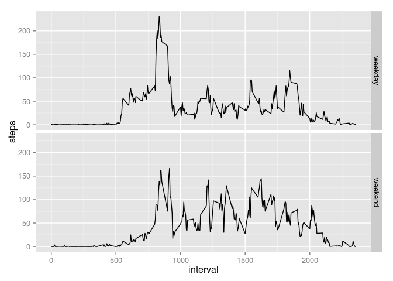

# Reproducible Research: Peer Assessment 1


## Loading and preprocessing the data


```r
  activity_data <- read.csv(unz("activity.zip", "activity.csv"))
  activity_data$date <- as.Date(activity_data$date, format="%Y-%m-%d")
  clean_activity_data <- activity_data[complete.cases(activity_data), ]
  incomplete_data <- activity_data[!complete.cases(activity_data), ]
```

## What is mean total number of steps taken per day?

Here is the code to produce the histogram of steps taken each day, as well as calculate the mean and median of steps taken each day.


```r
  require(ggplot2)
```

```
## Loading required package: ggplot2
```

```r
  sums <- as.numeric(tapply(clean_activity_data$steps, clean_activity_data$date, FUN=sum))
  histo <- qplot(sums, geom='histogram', fill=..count.., xlab="Total Steps", ylab="Number of Days")
  sums_mean <- mean(sums)
  sums_median <- median(sums)
```

Here is the resulting histogram:

 

The mean number of steps taken each day was **1.0766189\times 10^{4}**.

The median number was **1.0765\times 10^{4}**.

Sorry if this is in an odd notation - for some reason it changes to appear this way when I knit the file.

## What is the average daily activity pattern?

Here is the code for the time series plot of the average daily activity patterns:


```r
  means <- aggregate(steps ~ interval, clean_activity_data, mean)
  timeSeries <- ggplot(means, aes(x=interval, y=steps), xlab="Interval", ylab="Avg. Number of Steps Taken") + geom_line()
  highest <- means[which.max(means$steps),]
  timeSeries <- timeSeries + geom_point(data=highest, color='red', size=4)
  timeSeries <- timeSeries + geom_text(aes((highest[1,1] + 700), highest[1,2], label=paste("Most Active Interval is #", as.character(highest[1,1]))))
```

Here is the resulting time series plot. This plot also addresses which interval has the highest average activity.

 

## Imputing missing values


```r
  incomplete_obs <- nrow(incomplete_data)
```

The number of incomplete observations (number of rows with NAs) is **2304**.

**2304** divided by 8 is 288, which happens to be the exact number of observations made in a given day. Taking a look at the incomplete_data data frame reveals that there are 8 dates:


```r
  unique(incomplete_data$date)
```

```
## [1] "2012-10-01" "2012-10-08" "2012-11-01" "2012-11-04" "2012-11-09"
## [6] "2012-11-10" "2012-11-14" "2012-11-30"
```

Looking through each of these 8 subsets manually reveals that all the data are missing for each day, which means that our problem is confined to those 8 days (and is therefore easier to solve). Because these days have no data of their own, we can simply replace the NAs with the mean for each interval from the other days. A numeric vector of these means already exists from the previous problem - means$steps.

The code below replaces the NA days with means$steps:


```r
  updated_activity_data <- activity_data
  unis <- unique(incomplete_data$date)
  for (i in seq_along(unis)) {
    updated_activity_data[updated_activity_data$date == unis[i], 1] <- means$steps
  }
```

The new dataset is now stored in the variable **updated_activity_data**. The same code for the previous histogram can be repurposed here:


```r
  q3_sums <- as.numeric(tapply(updated_activity_data$steps, updated_activity_data$date, FUN=sum))
  q3_histo <- qplot(q3_sums, geom='histogram', fill=..count.., xlab="Total Steps", ylab="Number of Days")
  q3_sums_mean <- mean(q3_sums)
  q3_sums_median <- median(q3_sums)
```

Here is the resulting histogram:

 

The mean number of steps taken each day was **1.0766189\times 10^{4}**.

The median number was **1.0766189\times 10^{4}**.

Obviously, the mean value doesn't differ because my method for filling in NAs was just to replace them with the mean value. However, adding all those additional observations equal to the mean did influence the median - it is now the same as the mean.

The main influence of imputing the missing data was to greatly increase the number of observations that matched the mean - this is evident in the increase in the first bin after 10000 on the histogram above.

## Are there differences in activity patterns between weekdays and weekends?

First, create the factor.


```r
wkends <- c('Saturday', 'Sunday')
updated_activity_data$wkfactor <- factor((weekdays(updated_activity_data$date) %in% wkends), levels=c(TRUE, FALSE), labels=c('weekend', 'weekday'))
```

Now use the factor to get the means for each group. Then merge them back together and add the factor back in.


```r
  q4_weekend_means <- aggregate(steps ~ interval, updated_activity_data[updated_activity_data$wkfactor == "weekend",], mean)
  q4_weekend_means$wkfactor <- "weekend"
  q4_weekday_means <- aggregate(steps ~ interval, updated_activity_data[updated_activity_data$wkfactor == "weekday",], mean)
  q4_weekday_means$wkfactor <- "weekday"
  q4_means <-rbind(q4_weekend_means, q4_weekday_means)
```

Finally, generate the panel plot:


```r
  panelPlot <- ggplot(q4_means, aes(x=interval, y=steps), xlab="Interval", ylab="Avg. Number of Steps Taken") + geom_line()
  panelPlot <- panelPlot + facet_grid (wkfactor ~ .)
```

 
